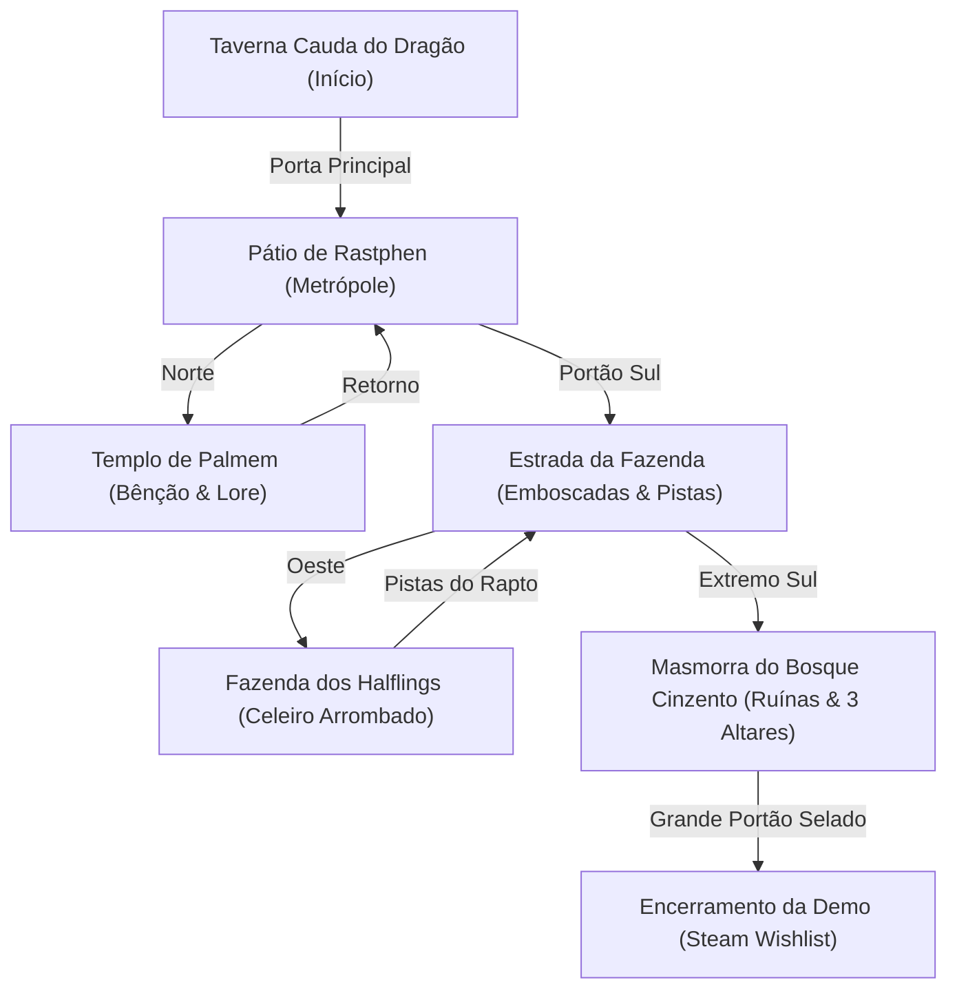

<div align="center">

# ⚔️ Sombras de Brentel: Prólogo
### *Os Seis Contra o Abismo: A Floresta Cinzenta*

[](https://phaser.io/)
[](https://www.electronjs.org/)
[](https://vitejs.dev/)
[-F7DF1E.svg?style=for-the-badge&logo=javascript)](https://developer.mozilla.org/)
[](https://nodejs.org/)
[](#-equipe--créditos)

<p align="center">
  <strong>Um RPG 2D clássico em turnos e exploração top-down imersiva com arquitetura Data-Driven.</strong><br>
  Uma jornada tática de vingança, honra e confronto contra a pestilência abissal.
</p>

---

</div>

## 📖 Sobre o Jogo

**Sombras de Brentel - Prologue** é um RPG tático e narrativo em 2D desenvolvido pela **Velhos Games**. Inspirado nos clássicos de 16-bits da era de ouro dos JRPGs, o jogo serve como o prelúdio épico do conto de fantasia sombria **"Os Seis Contra o Abismo: A Floresta Cinzenta"**, escrito por **Thiago Schardosin**.

Na pele de **Rhogar Tordan**, um guerreiro draconato meio-sangue empunhando a lendária lâmina de sua mãe, os jogadores exploram a metrópole amuralhada de **Rastphen**, investigam horrores arcanos no **Templo de Palmem**, seguem rastros de rapto na **Estrada da Floresta** e adentram as ruínas amaldiçoadas da **Masmorra do Bosque Cinzento** para confrontar cultistas e o temível Minotauro Abissal.

---

## 🎮 Funcionalidades Principais

* **⚔️ Sistema de Combate Tático em Turnos:** 
  - Controle 100% por teclado ou Gamepad.
  - Seleção estratégica de alvos múltiplos com retículo visual.
  - Sistema dinâmico de **Fúria** para habilidades devastadoras.
  - Mitigação realista de dano baseada em Defesa e penetração de armadura.
* **💥 Game Juice & Impacto Cinético:**
  - **Hit-Stop (Micro-pausas de 80ms~90ms)** para transmitir o peso real de cada golpe.
  - **Screen Shake Escalonado** calibrado por faixas de dano (Leve, Médio e Crítico).
  - Emissores de partículas para cortes físicos e descargas elétricas.
* **🗺️ Exploração Top-Down & Zonas Interativas:**
  - Câmera suave com tracking de coordenadas.
  - Baús de itens com espólio e notificações flutuantes.
  - Emboscadas de inimigos no mapa sem transições desnecessárias.
* **📜 Diálogos com Retratos Dinâmicos & Escolhas Múltiplas:**
  - Interface baseada em máquina de escrever (*Typewriter effect*).
  - Retratos expressivos e caixas de diálogo auto-expansíveis.
  - Ramificações de escolhas com respostas reativas dos NPCs.
* **🗃️ Arquitetura 100% Data-Driven:**
  - Missões, diálogos, inimigos e portais configurados via arquivos JSON desacoplados.
* **💾 Persistência Multi-Ambiente:**
  - Salvamento automático de progresso (Ouro, Itens, Quests e Checkpoints) em disco local e LocalStorage.
* **⚡ Overlay Global de Interface (UIScene):**
  - Gerenciamento desacoplado de HUD e caixas de texto via EventBus central.

---

## 🧙 Classes de Heróis

<table>
  <thead>
    <tr>
      <th>Herói</th>
      <th>Classe / Arquétipo</th>
      <th>Descrição & Mecânicas</th>
    </tr>
  </thead>
  <tbody>
    <tr>
      <td><strong>Rhogar Tordan</strong><br><em>(Protagonista)</em></td>
      <td><strong>Cavaleiro Draconato (Guerreiro / Mago Tempestuoso)</strong></td>
      <td>Especialista em combate corpo a corpo e geração de Fúria ao receber ou causar impacto. Desfere cortes pesados com a <em>Lâmina de Brentel</em> e invoca o devastador <strong>Sopro Elétrico</strong>, que ignora 50% da armadura inimiga.</td>
    </tr>
    <tr>
      <td><strong>Gruther</strong></td>
      <td><strong>Campeão Protetor (Paladino)</strong></td>
      <td>Guerreiro de vanguarda que caiu vítima de feitiçaria abissal ao defender a fazenda. Seu destino e leito no Templo representam o estopim da caçada de Rhogar.</td>
    </tr>
    <tr>
      <td><strong>Traudon</strong></td>
      <td><strong>Druida da Colina (Shifter / Suporte)</strong></td>
      <td>Druida anão beberrão da Taverna Cauda do Dragão. Manipula energias da terra e fornece conhecimento das rotas selvagens.</td>
    </tr>
    <tr>
      <td><strong>Verônica Stinfy</strong></td>
      <td><strong>Arcanista Abissal (Maga / Necromante)</strong></td>
      <td>Estudiosa de manuscritos arcanos sombrios que monitora a distorção da trama mágica em Brentel.</td>
    </tr>
    <tr>
      <td><strong>John Bardem</strong></td>
      <td><strong>Caçador de Recompensas (Ladino / Rastreador)</strong></td>
      <td>Perito em emboscadas, rastreamento de alvos fugitivos e exploração de pontos fracos.</td>
    </tr>
  </tbody>
</table>

---

## 🗺️ Mundo & Pontos de Interesse



* **🍺 Taverna Cauda do Dragão:** Ponto de encontro de aventureiros, comércio de suprimentos com a anã Hilda e o gatilho narrativo do Flashback de Estayler com Joseph Sylven.
* **🏰 Pátio da Cidade de Rastphen:** Centro fortificado da metrópole (2400x1800) guardado pela milícia armada, ligando as rotas da Taverna, do Templo e do Portão Sul.
* **⛪ Templo de Palmem:** Santuário sagrado onde repousa Gruther convalescente sob os cuidados e profecias da Sacerdotisa de Palmem.
* **🌾 Fazenda dos Halflings & Estrada do Bosque:** Caminho ladeado por névoa densa, baús de espólio, patrulhas de goblins e o celeiro despedaçado onde pistas de icor negro revelam o rastro da besta.
* **🕯️ Masmorra do Bosque Cinzento:** Ruínas subterrâneas infestadas por horrores e 3 altares rúnicos de purificação que trancam a câmara do pesadelo.

---

## ⚔️ Arsenal & Equipamentos

| Item / Habilidade | Tipo | Efeito & Descrição |
| :--- | :--- | :--- |
| **Lâmina de Brentel** | Arma Lendária | Espada herdada da mãe de Rhogar. Causa dano físico padrão mitigado pela defesa. |
| **Sopro Elétrico** | Magia Dracônica | Consome 50 de Fúria. Dispara relâmpagos em arco que **perfuram 50% da defesa do alvo**. |
| **Postura Defensiva** | Tática | Reduz o dano recebido no próximo turno e restaura **+15 de Fúria**. |
| **Poção de Vida** | Consumível | Restaura instantaneamente **+50 Pontos de Vida (HP)** até o limite máximo. |
| **Cerveja Anã de Colina** | Consumível | Cerveja forte artesanal. Restaura **+30 de Fúria** de combate imediatamente. |

---

## 🎯 Modos de Dificuldade

* **🗡️ Normal (História & Tática):** A experiência narrativa balanceada com gerenciamento de fúria e uso pontual de poções.
* **🔥 Difícil (Veterano de Brentel):** Inimigos com dano ampliado e defesas elevadas, exigindo posicionamento e postura defensiva constante.
* **💀 Modo Pesadelo (Morte Permanente / Permadeath):** A derrota em qualquer masmorra apaga os checkpoints salvos.

---

## 🕹️ Controles do Jogo

<div align="center">

| Ação | Teclado Primário | Teclado Secundário | Gamepad |
| :---: | :---: | :---: | :---: |
| **Mover para Cima** | `W` | `Seta Acima (↑)` | `D-Pad Cima / Analógico` |
| **Mover para Baixo** | `S` | `Seta Abaixo (↓)` | `D-Pad Baixo / Analógico` |
| **Mover para Esquerda** | `A` | `Seta Esquerda (←)` | `D-Pad Esquerda / Analógico` |
| **Mover para Direita** | `D` | `Seta Direita (→)` | `D-Pad Direita / Analógico` |
| **Confirmar / Interagir / Avançar** | `Z` | `Espaço` / `Enter` | `Botão A (Xbox) / ✕ (PS)` |
| **Cancelar / Fechar Mapa** | `X` | `ESC` | `Botão B (Xbox) / ○ (PS)` |
| **Menu de Pausa** | `ESC` | `ESC` | `Botão Start` |

### 🛠️ Atalhos de Desenvolvedor (Debug Mode)
`F1` Alternar Hitboxes de Física | `F2` Completar Todas as Missões | `1` a `5` Teletransporte de Cenas

</div>

---

## 🚀 Como Executar o Projeto

### Pré-requisitos
* [Node.js](https://nodejs.org/) versão 18 ou superior instalada.
* [Git](https://git-scm.com/) instalado.

### 1. Clonar o Repositório
```bash
git clone https://github.com/ojoesevero/sombras-de-brentel-prologue.git
cd sombras-de-brentel-prologue
```

### 2. Instalar as Dependências
```bash
npm install
```

### 3. Executar o Jogo
* **Modo Desktop (Electron + Vite):**
  ```bash
  npm run electron:dev
  ```
* **Modo Web Browser (Vite Server):**
  ```bash
  npm run dev
  ```
* **Executar Suíte de Testes Automatizados:**
  ```bash
  npm test
  ```
* **Gerar Build de Produção (.EXE / Distribuição):**
  ```bash
  npm run electron:build
  ```

---

## 📁 Estrutura de Arquivos

```text
sombras-de-brentel-prologue/
├── docs/                       # Governança viva e documentação técnica
│   ├── CHANGELOG.md            # Histórico de versões (Keep a Changelog)
│   └── DEVLOG.md               # Diário de arquitetura e decisões de engenharia
├── electron/                   # Processo principal Desktop (Electron)
│   ├── main.js                 # Boot de janela Chromium nativa e retry de servidor
│   └── preload.cjs             # Bridge IPC segura (contextIsolation)
├── public/                     # Assets estáticos e base Data-Driven
│   ├── assets/                 # Imagens, sprites e áudios
│   └── data/                   # Repositório de dados em JSON puro
│       ├── map_transitions.json # Mapeamento de portais e triggers espaciais
│       ├── quests.json          # Banco de missões e objetivos
│       ├── act2_interactions.json # Diálogos de NPCs de Rastphen e da Fazenda
│       └── tavern_interactions.json # Diálogos ramificados da Taverna
├── src/                        # Código-fonte da aplicação (ES Modules)
│   ├── entities/               # Modelos e FSM de Entidades (Player.js)
│   ├── scenes/                 # Cenas do Phaser (Tavern, Battle, Temple, etc.)
│   │   └── UIScene.js          # Overlay global para diálogos e HUD
│   ├── services/               # Singletons de orquestração de sistemas
│   │   ├── WorldManager.js     # Transições e spawn de mapa
│   │   ├── QuestManager.js     # Máquina de estados de missões
│   │   ├── InputManager.js     # Padronização de comandos e ciclo de vida
│   │   ├── InventoryManager.js # Economia e gestão de inventário
│   │   └── FXManager.js        # Efeitos visuais, Hit-Stop e partículas
│   ├── ui/                     # Componentes de interface (DialogueBox, ShopUI)
│   ├── utils/                  # Utilitários globais (Logger, DevShortcuts)
│   └── main.js                 # Inicializador e configurações do Phaser
├── tests/                      # Testes unitários puros (Node Test Runner)
│   ├── QuestManager.test.js    # Testes de regras de negócio de missões
│   └── InventoryManager.test.js # Testes de economia e consumo de itens
├── package.json                # Manifesto de dependências e scripts npm
├── vite.config.js              # Configurações do bundler Vite
└── README.md                   # Documentação principal do projeto
```

---

## 🛠️ Tecnologias Utilizadas

<div align="center">

| Tecnologia | Finalidade no Projeto |
| :--- | :--- |
| **Phaser 3 / 4** | Motor de renderização 2D WebGL/Canvas, Arcade Physics, Tilemaps e Cenas. |
| **Electron** | Executável Desktop nativo multiplataforma com janela desacoplada. |
| **Vite** | Bundler de última geração com Hot Module Replacement (HMR) ultrarrápido. |
| **Node.js (v20+)** | Runtime de execução, gerenciamento de pacotes e test runner nativo (`node:test`). |
| **EventBus (EventEmitter)** | Arquitetura desacoplada e reativa para comunicação entre UI, Mundo e Combate. |

</div>

---

## 👥 Equipe & Créditos

<div align="center">

| Papel | Nome | Contato / Perfil |
| :--- | :--- | :--- |
| **Produtora** | **Velhos Games** | [GitHub Organização](https://github.com/ojoesevero) |
| **Desenvolvimento & Engenharia** | **Joe Severo** | [@ojoesevero](https://github.com/ojoesevero) |
| **História, Roteiro & Lore** | **Thiago Schardosin** | *Autor Original do Universo* |

<br>

> *Baseado no conto original:*<br>
> **"Os Seis Contra o Abismo: A Floresta Cinzenta"** — Criado por Thiago Schardosin.

</div>

---

## 📜 Licença

Distribuído sob a licença proprietária **Velhos Games © 2026**. Todos os direitos narrativos, conceituais e artísticos reservados.

<div align="center">
  <sub>Desenvolvido com dedicação e paixão por jogos clássicos pela equipe da <strong>Velhos Games</strong>.</sub>
</div>
