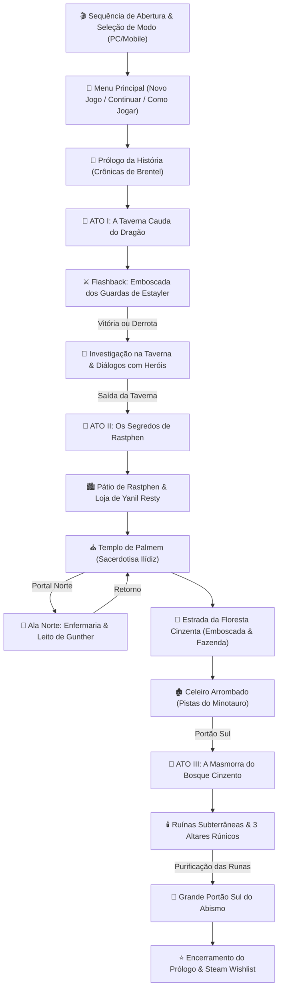

<div align="center">

# ⚔️ Sombras de Brentel: Prólogo
### *Baseado no livro: "Os Seis Contra o Abismo — A Floresta Cinzenta"*
#### *Escrito por Thiago Schardosin | Produzido por Velhos Games*

<br>

<!-- BADGES PRINCIPAIS -->
[](https://sombras-de-brentel.vercel.app/)
[](https://phaser.io/)
[](https://www.electronjs.org/)
[](https://vitejs.dev/)
[-F7DF1E.svg?style=for-the-badge&logo=javascript)](https://developer.mozilla.org/)
[-brightgreen.svg?style=for-the-badge&logo=node.js)](https://nodejs.org/)

<br>

<!-- HERO CARD / CTA DE JOGO ONLINE -->
<table>
  <tr>
    <td align="center" style="background: linear-gradient(135deg, #16161d 0%, #0d0d12 100%); border: 2px solid #d4af37; border-radius: 12px; padding: 24px;">
      <h2 style="color: #ffd700; margin-bottom: 8px;">🌐 Versão Web Oficial Disponível!</h2>
      <p style="color: #e0e0e0; font-size: 16px; line-height: 1.6; max-width: 680px;">
        Jogue agora mesmo direto pelo navegador do seu <strong>computador, tablet ou smartphone</strong> sem necessidade de download ou instalação. Suporte completo a <strong>Teclado</strong> e <strong>Controles Virtuais Touch (Mobile)</strong>!
      </p>
      <a href="https://sombras-de-brentel.vercel.app/" target="_blank">
        
      </a>
      <br><br>
      <sub>🔗 <code>https://sombras-de-brentel.vercel.app/</code></sub>
    </td>
  </tr>
</table>

<br>

<p align="center">
  <strong>Um RPG 2D tático em turnos com exploração top-down imersiva e arquitetura 100% Data-Driven.</strong><br>
  Uma jornada implacável de honra, vingança e confronto contra as forças profanas do Abismo.
</p>

---

</div>

<br>

## 📖 Sobre a Obra e o Universo

**Sombras de Brentel - Prologue** é um RPG tático desenvolvido pela **Velhos Games** e concebido por **Joe Severo**, servindo como introdução interativa oficial do livro **"Os Seis Contra o Abismo: A Floresta Cinzenta"**, de autoria de **Thiago Schardosin**.

Ambientado no continente de **Brentel** no ano de **312 D.I.**, o enredo acompanha os passos de **Rhogar Tordan**, um vigoroso bárbaro draconato que empunha a lâmina de sua mãe falecida, e **Joseph Sylven**, um acólito meio-elfo devoto de Lízan. Unidos pela necessidade brutal de sobrevivência após escaparem da emboscada dos guardas da Casa Estayler, a dupla busca refúgio na amuralhada metrópole de **Rastphen**.

Por trás das paredes de pedra e das mesas da **Taverna Cauda do Dragão**, sussurros sombrios revelam que uma misteriosa pestilência mágica está corrompendo as matas vizinhas, sequestrando inocentes e abrindo caminhos para horrores ancestrais que repousam na esquecida **Masmorra do Bosque Cinzento**.

---

## 🌟 Novidades & Destaques da Versão Recente

<div align="center">
<table>
  <tr>
    <td width="50%" valign="top">
      <h3 align="center">🎒 Sistema de Inventário & Economia</h3>
      <ul>
        <li><strong>Mochila em Grade (InventoryScene):</strong> Abertura sobreposta com tecla <kbd>I</kbd> ou botão touch, inspeção de descrições, consumo de poções, pergaminhos e equipamentos.</li>
        <li><strong>Lojas & Mercadores:</strong> Balcão de Hilda na taverna e o <em>Empório de Yanil Resty</em> em Rastphen com itens exclusivos do lore.</li>
      </ul>
    </td>
    <td width="50%" valign="top">
      <h3 align="center">🏆 Conquistas & Progressão</h3>
      <ul>
        <li><strong>Sistema de Conquistas:</strong> Desbloqueio de marcos canônicos com banner flutuante no topo e persistência automática.</li>
        <li><strong>XP e Level Up em Combate:</strong> Rhogar ganha experiência, sobe de nível e aprimora atributos e Habilidades.</li>
      </ul>
    </td>
  </tr>
  <tr>
    <td width="50%" valign="top">
      <h3 align="center">🎵 Sonoplastia & Trilha Sonora BGM</h3>
      <ul>
        <li><strong>Sistema Global de Áudio (AudioManager):</strong> Transições suaves (*fade in/out*) e persistência entre mapas sem cortes bruscos.</li>
        <li><strong>Trilhas Temáticas:</strong> 6 Músicas de Fundo (BGM) originais, incluindo o tema de batalha canônico *Fúria de Estayler*.</li>
        <li><strong>SFX Polido:</strong> Cooldown de input na UI (Anti-Bubbling) e novo *sfx_ui_hover* para navegação menos cansativa.</li>
      </ul>
    </td>
    <td width="50%" valign="top">
      <h3 align="center">🏙️ Atmosfera de Lei Marcial</h3>
      <ul>
        <li><strong>Rastphen Sitiada:</strong> Novo visual atmosférico com filtro frio (0x001a33), neblina assustadora (BlendMode: SCREEN) e sem civis nas ruas.</li>
        <li><strong>Portas Trancadas & Sussurros:</strong> Interações com portas trancadas que revelam o terror instaurado pelo culto.</li>
        <li><strong>Patrulhas Mecânicas:</strong> Guardas no Portão Sul se movimentam fluidamente via sistema de Tweens O(1).</li>
      </ul>
    </td>
  </tr>
  <tr>
    <td width="50%" valign="top">
      <h3 align="center">⚡ Performance & Otimização</h3>
      <ul>
        <li><strong>Refatoração de Raiz Quadrada:</strong> Substituição total de <code>Distance.Between</code> por <code>Distance.Squared</code> em todos os NPCs, aliviando o ciclo <code>update()</code>.</li>
        <li><strong>Memory Leak Corrigido:</strong> Eventos isolados e atados ao <code>SHUTDOWN</code> do Phaser. Lixo residual recolhido (Garbage Collection otimizado).</li>
      </ul>
    </td>
    <td width="50%" valign="top">
      <h3 align="center">📊 Telemetria (Vercel Analytics)</h3>
      <ul>
        <li><strong>Tracking Integrado:</strong> Monitoramento nativo sem cookies via injeção direta do Vercel Analytics.</li>
        <li><strong>Web Vitals em Tempo Real:</strong> Acompanhamento de performance global (FCP, LCP) sem invasão à privacidade.</li>
      </ul>
    </td>
  </tr>
</table>
</div>

---

## 🎮 Funcionalidades do Gameplay

* **⚔️ Combate Tático em Turnos Dinâmico:**
  - Sistema de **Fúria**: Gere energia arcana ao desferir golpes ou resistir a danos.
  - Habilidade **Sopro Elétrico**: Descarga tempestuosa que penetra **50% da defesa** dos inimigos.
  - **Mitigação Realista de Armadura**: Cálculo matemático de redução de dano baseado na Defesa do alvo com variação orgânica.
  - Seleção livre de alvos múltiplos com retículo visual inteligente.
  - Sistema de **XP e Level Up**: Ganho de experiência e evolução progressiva de atributos após batalhas.
* **🎒 Mochila e Gestão de Itens:**
  - Consumo de **Poções de Vida**, **Cerveja Anã**, **Pergaminhos do Trovão** e equipamentos como o **Manto Élfico**.
* **🏆 Sistema de Conquistas:**
  - Conquistas desbloqueáveis como *"Por Onde Andei"* (embriaguez), *"Visita Fraterna"* (visitar Gunther) e *"Cliente Persistente"*.
* **💥 Game Juice & Sensação de Impacto (Hit-Stop & Partículas):**
  - **Hit-stop de 80ms~90ms** para conferir peso visceral a acertos físicos e críticos.
  - **Screen Shake Escalonado** calibrado conforme a severidade do golpe recebido.
  - Clarões de tela (*Flash Screen*) e arcos de corte com rastros de partículas.
* **🗺️ Exploração de Mundo Aberto com Câmera Suave:**
  - Malha urbana expansiva de **Rastphen (2400x1800)**, mapas da **Floresta (1600x1200)** e **Enfermaria do Templo (800x600)**.
  - Portais e transições data-driven carregados dinamicamente via `map_transitions.json`.
  - Baús de exploração com saques de ouro e consumíveis.
* **📜 Diálogos com Retratos Expressivos & Ramificações:**
  - Efeito máquina de escrever (*Typewriter*) com avanço rápido e caixas responsivas.
  - Sistema de escolhas múltiplas com respostas reativas de NPCs e pensamentos internos.
* **💾 Persistência Híbrida Blindada:**
  - Suporte trifásico a salvamento: **Electron IPC seguro (`userData`)** $\rightarrow$ **LocalStorage (Navegador)** $\rightarrow$ **Memória Volátil**.
  - Codificação em Base64 com suporte integral a UTF-8 e acentuação da língua portuguesa.

---

## 🗺️ Mapa de Progressão da Campanha



---

## 📚 Crônicas dos Atos

<table>
  <thead>
    <tr>
      <th align="center">Ato</th>
      <th>Título Oficial</th>
      <th>Sinopse Canônica</th>
      <th align="center">Cenários Principais</th>
    </tr>
  </thead>
  <tbody>
    <tr>
      <td align="center"><strong>ATO I</strong></td>
      <td><strong>A Taverna Cauda do Dragão</strong></td>
      <td><em>"No continente de Brentel, no ano de 312 D.I., caminhos imprevisíveis cruzam a vida de heróis marcados pelo destino. O acólito meio-elfo Joseph Sylven e o draconato Rhogar encontram-se na Taverna Cauda do Dragão, onde segredos e sussurros dão início a uma jornada implacável."</em></td>
      <td align="center"><code>TavernScene</code></td>
    </tr>
    <tr>
      <td align="center"><strong>ATO II</strong></td>
      <td><strong>Os Segredos de Rastphen</strong></td>
      <td><em>"A imponência do Templo de Palmem contrasta com a tensão que toma conta da região sul. Na Ala Norte, o monge Gunther delira em seu leito. Na Estrada da Fazenda, celeiros arrombados e rastros de criaturas sombrias exigem que Rhogar investigue a origem da corrupção que assola os arredores."</em></td>
      <td align="center"><code>RastphenCityScene</code><br><code>YanilShopScene</code><br><code>TempleScene</code><br><code>TempleNorthScene</code><br><code>ForestRouteScene</code></td>
    </tr>
    <tr>
      <td align="center"><strong>ATO III</strong></td>
      <td><strong>A Masmorra do Bosque Cinzento</strong></td>
      <td><em>"Entre a névoa densa e árvores seculares de troncos avermelhados, repousa a entrada da masmorra. O Grande Portão encontra-se lacrado por feitiçaria abissal. O herói deve purificar os altares rúnicos de pestilência para romper o selo e enfrentar o horror iminente."</em></td>
      <td align="center"><code>DungeonScene</code></td>
    </tr>
  </tbody>
</table>

---

## 🧙 Heróis & Personagens Principais

<div align="center">

| Personagem | Arquétipo / Função | Descrição & Papel no Enredo |
| :--- | :--- | :--- |
| **Rhogar Tordan** | **Bárbaro Draconato (Guerreiro Tempestuoso)** | Protagonista. Guerreiro implacável que acumula Fúria em batalha para invocar o devastador *Sopro Elétrico*. Luta pela memória de sua família e pela libertação dos povos oprimidos. |
| **Joseph Sylven** | **Acólito Meio-Elfo (Devoto de Lízan / Clérigo)** | Elo entre Rhogar e os mistérios sagrados. Suas visões e fé guiam a busca por respostas sobre a corrupção abissal que infecta o clero e os soldados. |
| **Gunther** | **Monge / Sobrevivente Ferido** | Convalescente no leito da Ala Norte do Templo de Palmem após o ataque na estrada. Entrega uma Poção de Vida a Rhogar e relata os horrores da fazenda. |
| **Hilda Barba-de-Ferro** | **Comerciante Anã da Taverna** | Proprietária e negociante de suprimentos da Taverna Cauda do Dragão. Vende a autêntica *Cerveja Anã* e itens essenciais. |
| **Yanil Resty** | **Mercador de Rastphen** | Comerciante itinerante que gerencia sua loja no pátio da cidade, vendendo mantos élficos, pergaminhos e sedas raras de Walldarten. |
| **Sacerdotisa Ilídiz** | **Guardiã do Santuário de Palmem** | Mantenedora das bênçãos do templo. Revela a Rhogar a situação de Gunther e orienta sua partida rumo ao sul. |

</div>

---

## 🕹️ Guia de Controles

### 💻 No Computador (PC / Desktop)
| Comando | Tecla Primária | Tecla Alternativa | Ação |
| :--- | :---: | :---: | :--- |
| **Mover Personagem** | <kbd>W</kbd> <kbd>A</kbd> <kbd>S</kbd> <kbd>D</kbd> | <kbd>▲</kbd> <kbd>◄</kbd> <kbd>▼</kbd> <kbd>►</kbd> | Movimentação 8-direções com velocidade diagonal normalizada. |
| **Interagir / Ação** | <kbd>Z</kbd> | <kbd>ESPAÇO</kbd> / <kbd>ENTER</kbd> | Falar com NPCs, examinar objetos, confirmar golpes e avançar diálogos. |
| **Mochila / Inventário** | <kbd>I</kbd> | <kbd>SHIFT</kbd> | Abrir o painel de inventário, consultar itens e usar poções. |
| **Cancelar / Fechar** | <kbd>X</kbd> | <kbd>ESC</kbd> | Fechar mochila, janelas e cancelar seleção de alvos no combate. |
| **Menu de Pausa** | <kbd>ESC</kbd> | — | Pausar o gameplay e abrir o menu de opções. |

### 📱 No Celular / Tablet (Mobile Touch)
| Controle Tátil | Localização na Tela | Ação |
| :--- | :---: | :--- |
| **D-Pad Virtual** | Canto Inferior Esquerdo | Toque contínuo nas setas (▲ ▼ ◄ ►) para movimentação suave. |
| **Botão de Ação `[ A / Z ]`** | Canto Inferior Direito | Interagir com o cenário, falar com personagens e avançar crônicas. |
| **Botão de Mochila `[ 📦 ]`** | Canto Inferior Direito (Centro) | Abrir o inventário e utilizar itens consumíveis. |
| **Botão de Menu `[ MENU ]`** | Canto Inferior Direito (Topo) | Pausar a sessão de jogo e alterar configurações. |
| **Toque na Caixa de Diálogo** | Área Central Inferior | Toque direto na caixa de texto para avançar frases e falas. |

---

## 🛠️ Tecnologias & Engenharia de Software

<div align="center">

| Tecnologia | Versão | Emprego na Arquitetura |
| :--- | :---: | :--- |
| **Phaser 3 / 4** | `^4.2.1` | Renderização via WebGL/Canvas, Arcade Physics, ciclo de vida de cenas e containers. |
| **Vite** | `^8.2.2` | Ferramenta de build, Hot Module Replacement (HMR) e empacotamento web otimizado. |
| **Electron** | `^44.0.0` | Container desktop Chromium com isolamento de contexto (`contextIsolation: true`) e IPC seguro. |
| **Node.js Test Runner** | `v20+` | 28 Testes unitários puros com asserções nativas (`node:test` e `node:assert`). |
| **Vercel** | — | Plataforma de deployment e hospedagem contínua da versão Web/Mobile. |

</div>

---

## 🚀 Como Executar o Projeto Localmente

### Pré-requisitos
* [Node.js](https://nodejs.org/) versão 18 ou superior instalada.
* [Git](https://git-scm.com/) instalado no sistema.

```bash
# 1. Clonar o repositório oficial
git clone https://github.com/ojoesevero/sombras-de-brentel-prologue.git

# 2. Entrar na pasta do projeto
cd sombras-de-brentel-prologue

# 3. Instalar os módulos de dependências
npm install
```

### Comandos Disponíveis

```bash
# Iniciar o jogo no modo Web (Abre em http://localhost:3000)
npm run dev

# Iniciar o jogo no modo Desktop (Electron)
npm run electron:dev

# Executar a suíte de 28 testes unitários automatizados
npm test

# Gerar o build otimizado para produção Web (/dist)
npm run build

# Gerar o instalador executável do Electron para Desktop
npm run electron:build
```

---

## 📁 Arquitetura de Diretórios

```text
sombras-de-brentel-prologue/
├── docs/                             # Documentação viva de engenharia
│   ├── CHANGELOG.md                  # Histórico de alterações e releases
│   ├── DEVLOG.md                     # Registros técnicos e decisões arquiteturais
│   ├── FLOWCHARTS.md                 # Diagramas de fluxo e diagramas Mermaid
│   ├── GDD.md                        # Game Design Document completo
│   └── SCENES.md                     # Mapa e documentação do roteamento das Cenas
├── electron/                         # Camada de runtime nativo Desktop
│   ├── main.js                       # Processo principal, ciclo de vida da janela, IPC e logs
│   ├── preload.cjs                   # Ponte IPC exposta com contextBridge segura
│   └── preload.js                    # Script de pré-carregamento auxiliar
├── logs/                             # Gravação contínua física de logs de jogo
│   └── game_interactions.log        # Registro de gameplay, inputs e diálogos
├── public/                           # Recursos estáticos e bancos data-driven
│   ├── assets/                       # Sprites, texturas, ícones e efeitos sonoros
│   └── data/                         # Arquivos de dados puros em JSON
│       ├── act2_interactions.json   # Diálogos do Ato II (Rastphen e Fazenda)
│       ├── dialogues.json            # Diálogos do prólogo de combate
│       ├── map_transitions.json     # Portais, triggers e metadados dos Atos
│       ├── quests.json               # Banco central de objetivos de missão
│       ├── tavern_interactions.json  # Diálogos e escolhas da Taverna (Ato I)
│       └── thought_interactions.json # Monólogos e pensamentos de bloqueio de Rhogar
├── src/                              # Código-fonte da aplicação (ES Modules)
│   ├── audio/                        # Gerenciamento sonoro
│   │   └── AudioManager.js           # BGM, efeitos SFX e fades de volume
│   ├── config/                       # Constantes de configuração
│   │   └── assets.js                 # Manifesto central de IDs de texturas e portraits
│   ├── entities/                     # Entidades físicas e mecânicas
│   │   ├── NPCWalker.js              # Controlador FSM para patrulhas e civis O(1)
│   │   └── Player.js                 # FSM de exploração, atributos de combate e XP/Level Up
│   ├── scenes/                       # Cenas orquestradas pelo Phaser
│   │   ├── ActIntroScene.js          # Introdução narrativa com lore oficial de cada Ato
│   │   ├── ActTransitionScene.js     # Transição cinematográfica entre grandes capítulos
│   │   ├── BattleScene.js            # Combate tático em turnos multi-alvo com Fúria
│   │   ├── DemoEndScene.js           # Conclusão do prólogo e link da Steam
│   │   ├── DungeonScene.js           # Ato III: Masmorra, altares rúnicos e fogueira
│   │   ├── ForestRouteScene.js       # Ato II: Estrada, emboscadas e celeiro
│   │   ├── GameOverScene.js          # Tela de derrota e recarregamento de save
│   │   ├── GameScene.js              # Cena introdutória de combate do flashback
│   │   ├── IntroSplashScene.js       # Telas de abertura e seletor PC/Mobile
│   │   ├── IntroStoryScene.js        # Prólogo narrativo do livro antes do gameplay
│   │   ├── InventoryScene.js         # Mochila: painel de itens, descrições e uso de consumíveis
│   │   ├── MenuScene.js              # Menu inicial com opção "Como Jogar"
│   │   ├── PauseScene.js             # Overlay de pausa e navegação de opções
│   │   ├── PreloadScene.js           # Pré-carregamento e texturas procedurais
│   │   ├── RastphenCityScene.js      # Ato II: Hub da cidade fortificada
│   │   ├── RewardScene.js            # Vitória em combate, ganho de XP e recompensas
│   │   ├── SettingsScene.js          # Ajustes de áudio, fullscreen e modo de controle
│   │   ├── TavernScene.js            # Ato I: Exploração da Taverna Cauda do Dragão
│   │   ├── TempleNorthScene.js       # Ato II: Ala Norte do Templo (Enfermaria de Gunther)
│   │   ├── TempleScene.js            # Ato II: Santuário sagrado de Palmem
│   │   ├── UIScene.js                # Overlay global (HUD, diálogos, D-Pad e conquistas)
│   │   └── YanilShopScene.js         # Loja de consumíveis e itens de Yanil Resty
│   ├── services/                     # Singletons e serviços desacoplados
│   │   ├── AchievementManager.js     # Gestão e desbloqueio de Conquistas
│   │   ├── FXManager.js              # Screen shake, hit-stop e efeitos de partículas
│   │   ├── InputManager.js           # Orquestrador de teclado, gamepad e virtual touch
│   │   ├── InventoryManager.js       # Gestão de itens consumíveis, equipamentos e ouro
│   │   ├── QuestManager.js           # Máquina de estados finita de missões
│   │   ├── SaveManager.js            # Persistência tolerante a falhas (Disk/Web)
│   │   └── WorldManager.js           # Transições de cena e orquestração de Atos
│   ├── ui/                           # Componentes visuais dedicados
│   │   ├── DialogueBox.js            # Caixa de diálogo dinâmica com retratos e opções
│   │   ├── ShopUI.js                 # Loja de compras de consumíveis
│   │   └── WorldMapUI.js             # Exibição gráfica do mapa-múndi
│   ├── utils/                        # Utilitários de diagnóstico e depuração
│   │   ├── DevShortcuts.js           # Atalhos de depuração (blindados para modo DEV)
│   │   ├── EnvironmentFX.js          # Emissores de partículas ambientais (pássaros, folhas)
│   │   └── Logger.js                 # Sistema unificado de logs com escrita física em arquivo
│   └── main.js                       # Instanciação da engine e registros de cenas
├── tests/                            # Testes de unidade automatizados (28 testes)
│   ├── AchievementManager.test.js    # Validações de desbloqueio e persistência de conquistas
│   ├── InventoryManager.test.js      # Validações de economia, itens e consumíveis
│   ├── PlayerProgression.test.js     # Validações de XP, Level Up e embriaguez
│   ├── QuestManager.test.js          # Validações de progressão de missões
│   └── SaveManager.test.js           # Validações de persistência UTF-8
├── package.json                      # Scripts de execução e dependências
├── vite.config.js                    # Configurações de compilação do Vite
└── README.md                         # Documentação oficial do projeto
```

---

## 👥 Equipe & Créditos Oficiais

<div align="center">

<table>
  <tr>
    <td align="center" width="33%">
      <h3>🎮 Produtora</h3>
      <p><strong>Velhos Games</strong></p>
      <p><a href="https://github.com/ojoesevero">GitHub Organização</a></p>
    </td>
    <td align="center" width="33%">
      <h3>💻 Engenharia & Código</h3>
      <p><strong>Joe Severo</strong></p>
      <p><a href="https://github.com/ojoesevero">@ojoesevero</a></p>
    </td>
    <td align="center" width="33%">
      <h3>📚 Obra Original & Lore</h3>
      <p><strong>Thiago Schardosin</strong></p>
      <p><em>Autor de "Os Seis Contra o Abismo"</em></p>
    </td>
  </tr>
</table>

<br>

> *Baseado no livro:*<br>
> **"Os Seis Contra o Abismo: A Floresta Cinzenta"** — Escrito por Thiago Schardosin.

<br>

---

<sub>Distribuído sob licença proprietária <strong>Velhos Games © 2026</strong>. Todos os direitos reservados.</sub>

</div>
