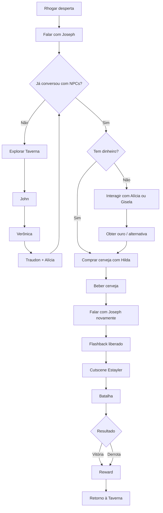
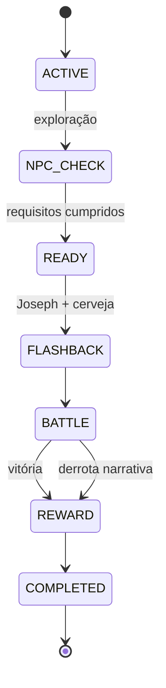
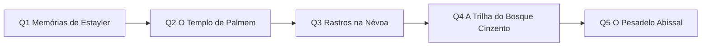
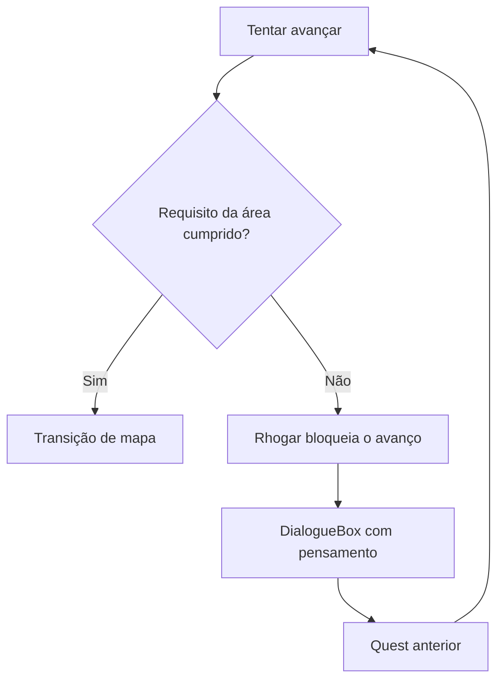
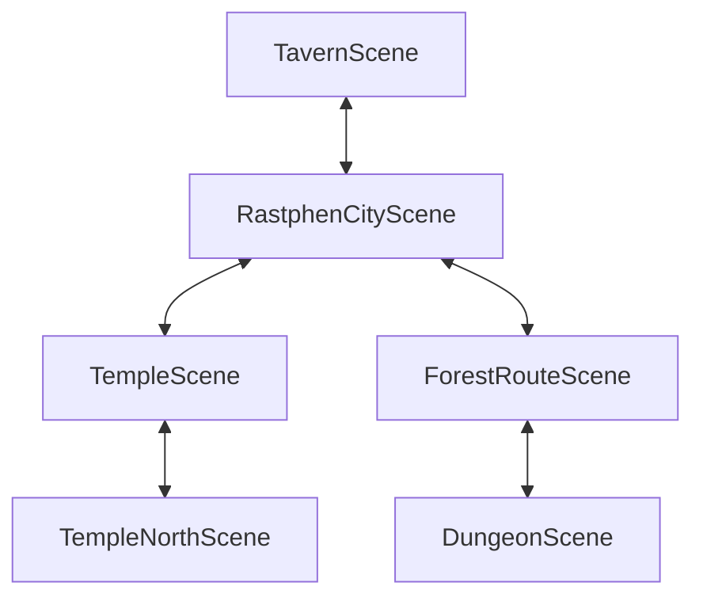
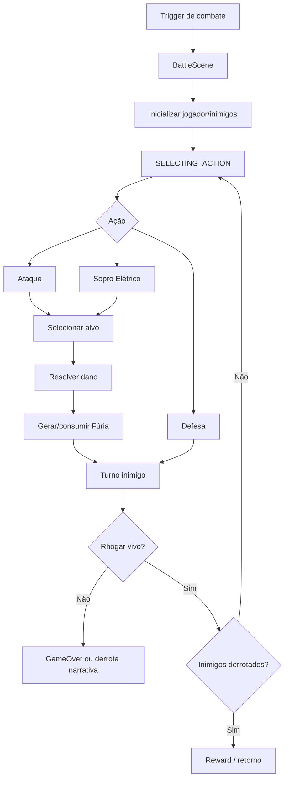
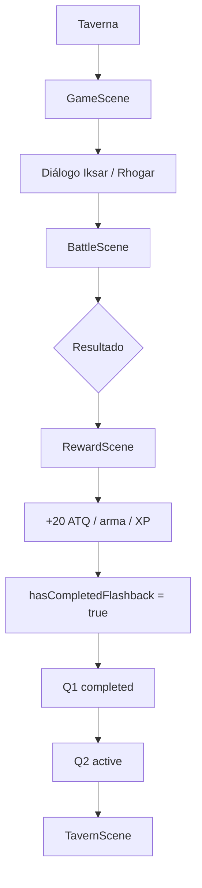
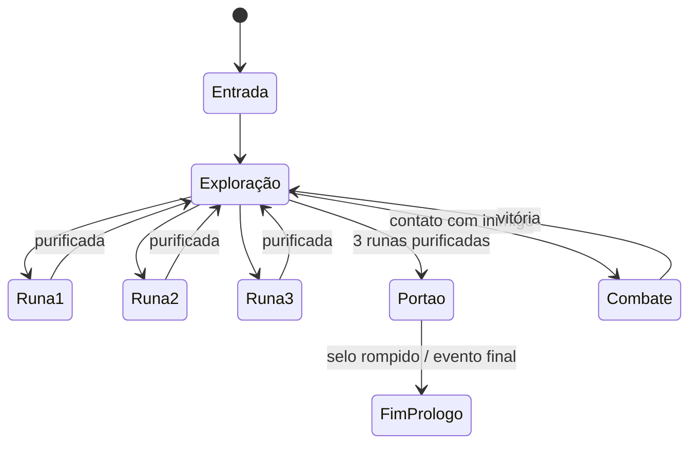
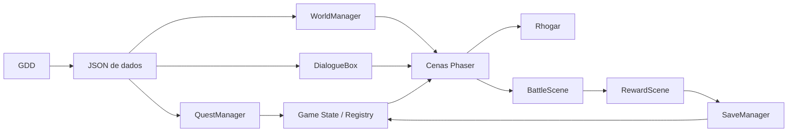

# Sombras de Brentel — Fluxogramas do Prólogo

## 1. Fluxo macro

```mermaid
flowchart TD
    A[IntroSplash] --> B[Menu / Novo Jogo]
    B --> C[IntroStory]
    C --> D[Act I — Taverna]
    D --> E{Exploração obrigatória}
    E --> F[Conversar com NPCs]
    F --> G[Verificar ouro / cerveja]
    G --> H[Falar com Joseph]
    H --> I[Flashback — Estayler]
    I --> J[Batalha Tutorial]
    J --> K[RewardScene]
    K --> L[Quest 1 concluída]
    L --> M[Quest 2 ativa]
    M --> N[Act II — Rastphen]
    N --> O[Templo de Palmem]
    O --> P[Gruther / Ala Norte]
    P --> Q[Retorno à cidade]
    Q --> R[Portão Sul]
    R --> S[Estrada Sul]
    S --> T[Fazenda Halfling]
    T --> U[Investigar celeiro]
    U --> V[Act III — Dungeon]
    V --> W[Purificar Runa 1]
    W --> X[Purificar Runa 2]
    X --> Y[Purificar Runa 3]
    Y --> Z[Grande Portão]
    Z --> FIM[Fim do Prólogo]
```



## 2. Ato I — decisão do jogador



## 3. Máquina de estado da Quest 1



## 4. Progressão das quests



## 5. Gating narrativo



### Gatilhos conhecidos

| Bloqueio | Requisito | Mensagem de Rhogar |
|---|---|---|
| Saída inicial | concluir/avançar Quest 1 | falar com Joseph antes de sair |
| Portão Sul | Quest 2 | visitar Templo de Palmem / Gruther |
| Entrada da dungeon | Quest 3 | investigar celeiro da fazenda |
| Grande Portão | 3 runas | purificar as 3 Runas de Pestilência |

## 6. Fluxo de mapas



## 7. Fluxo de combate



## 8. Flashback — exceção narrativa



**Importante:** a derrota do flashback é tratada como resultado narrativo, não como encerramento definitivo da campanha.

## 9. Dungeon — estado do puzzle



## 10. Fluxo técnico de dados



## 11. Fluxo de decisão de design

Toda nova decisão narrativa deve seguir:

```text
IDEIA
 ↓
CANON DO LIVRO?
 ├─ SIM → ADAPTAÇÃO PARA GAMEPLAY
 └─ NÃO → JUSTIFICAR DIVERGÊNCIA
             ↓
         IMPACTO NO JOGADOR?
             ↓
         NOVA FLAG/QUEST?
             ↓
         CONSEQUÊNCIA VISÍVEL?
             ↓
         TESTE AUTOMATIZÁVEL?
             ↓
         IMPLEMENTAÇÃO
             ↓
         DOCUMENTAÇÃO
```

## 12. Critério de fechamento de uma cena

Uma cena só deve ser considerada concluída quando tiver:

- entrada definida;
- objetivo do jogador;
- NPCs/objetos relevantes;
- diálogos;
- decisões;
- condições de bloqueio;
- saída/transição;
- flags alteradas;
- recompensa ou consequência;
- estado de save quando necessário;
- teste de regressão.
