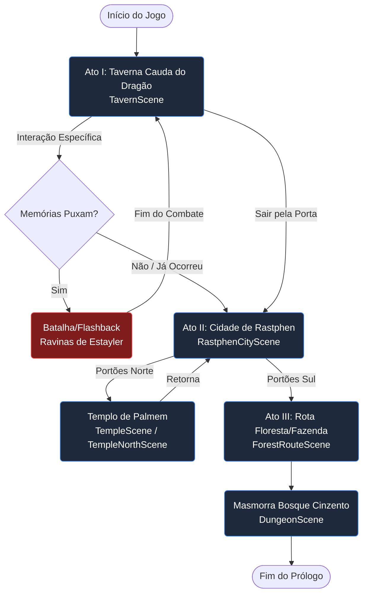

# Fluxogramas e Lógica de Jogo — Sombras de Brentel

Este documento detalha o fluxo principal do Prólogo e os sistemas condicionais de lógica interna do jogo.

---

## 1. Fluxo de Progressão Principal (Macro-Flow)

Abaixo, o fluxo estrutural de transição de mapas do Ato I ao Ato III do Prólogo.



---

## 2. Sistema de Interação na Taverna (Ato I)

Como o jogador navega pelos diálogos obrigatórios e opcionais na primeira cena.

```mermaid
flowchart TD
    Spawn[Rhogar acorda perto da mesa] --> QuestCheck{Falou com Joseph?}
    
    QuestCheck -- Não --> TalkOthers[Fala com Verônica / John]
    TalkOthers --> Block[Eles dizem: 'Fale com o Chefe Primeiro']
    Block -.-> QuestCheck
    
    QuestCheck -- Sim --> Joseph[Joseph entrega contexto do Culto]
    Joseph --> FlagsSet[Quest 'O Prólogo' Ativada]
    
    FlagsSet --> Bar[Fala com Hilda no Balcão]
    Bar --> Shop[Opção: Comprar Itens]
    Shop --> Beer{Comprou Cerveja?}
    
    Beer -- Sim --> Flash[Gatilho de Flashback\n(Inicia GameScene)]
    Beer -- Não --> Explore[Pode explorar, falar com Gisela, sair da Taverna]
    
    Flash --> Return[Volta para Taverna com status de Fúria Cheia]
    Return --> Explore
```

---

## 3. Arquitetura Orientada a Dados (Data-Driven Systems)

Visão geral de como os arquivos JSON coordenam as ações do jogo.


### Explicação da Arquitetura:
- **Phaser 3 Scene:** Representa o ambiente visual atual (ex: `RastphenCityScene`).
- **WorldManager:** Controla as colisões e acionamentos de portais baseados no `map_transitions.json`.
- **QuestManager:** Avalia `gameState.flags` contra os requisitos em `quests.json` para liberar novos diálogos ou mapas.
- Os **JSONs** agem como o *Source of Truth* do design. O código não deve possuir lógica de fluxo hardcoded.
